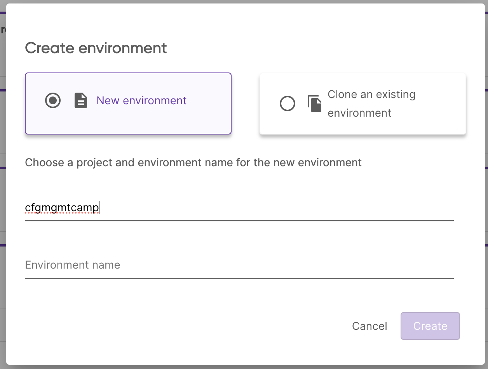
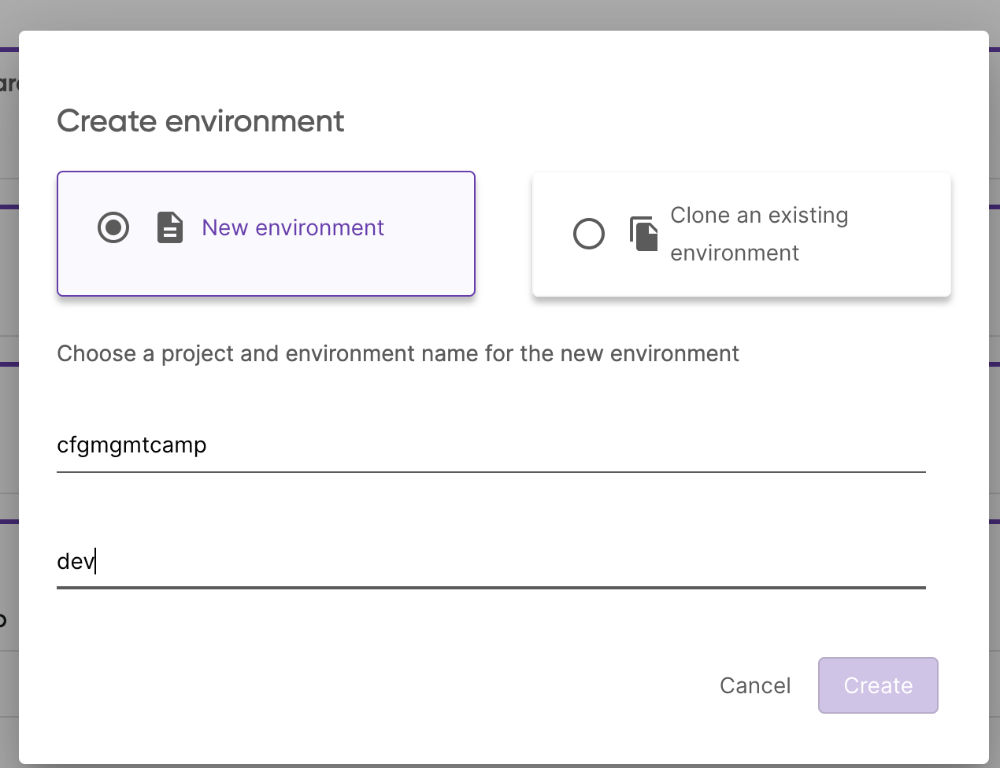

# Chapter 3 - Deploy the Application to Kubernetes

## Overview

In this chapter, we'll delve into some sophisticated Pulumi techniques:

- **Stack References**: Learn how to share outputs between various stacks
  using [Stack References](https://www.pulumi.com/docs/intro/concepts/stack/#stackreferences).

- **Programmatic Kubernetes Provider Creation**: Familiarize yourself with the `Provider` resource to create a
  Kubernetes provider programmatically. This is especially handy if you aim to utilize a different Kubernetes provider
  than the one initially used to establish the cluster.

- **Kubernetes Resource Deployment**: Discover how to deploy diverse Kubernetes resources to your cluster, sidestepping
  the traditional use of YAML files.

- **Pulumi ESC**: Learn how to use the Pulumi ESC to retrieve configuration and secrets from the Pulumi ESC inside your
  Pulumi program.

## Prerequisites

- The Kubernetes cluster from the [previous chapter](/00-create-kubernetes-cluster.md)

## Instructions

### Step 1 - Kickstart with a New Pulumi CLI Template!

> If you run Pulumi for the first time, you will be asked to log in. Follow the instructions on the screen to
> login. You may need to create an account first, don't worry it is free.

To lay the groundwork for a new Pulumi project, execute the command `pulumi new`.

Pulumi has plenty of pre-configured templates. For a comprehensive list, visit
the [Pulumi Templates](https://www.pulumi.com/templates/) page. And here's the exciting part: you're not confined to
these templates. Feel free to craft your bespoke templates and share the innovation with your team or broader
organization.

```bash
pulumi new kubernetes-<language>
```

You will be guided through a wizard to create a new Pulumi project. You can use the following values:

```bash
project name (01-create-nginx-deployment):
project description (A minimal <language> Pulumi program):  
Created project '01-create-nginx-deployment'

Please enter your desired stack name.
To create a stack in an organization, use the format <org-name>/<stack-name> (e.g. `acmecorp/dev`).
stack name (dev): dev 
...
```

The chosen template will default to Pulumi's standard Kubernetes provider, which aligns with your current Kubernetes
context. However, recalling our previous chapter, we crafted a Kubernetes cluster. Naturally, we'd want to utilize
the `kubeconfig` file from that endeavor. To achieve this, we can programmatically establish a Kubernetes provider with
the aid of the `Provider` resource.

Our first task is to fetch the `kubeconfig` output from the `00-create-kubernetes-cluster` stack. This can be seamlessly
accomplished through `StackReference`s.

For a deeper understanding and implementation details tailored to your programming language, refer to
the [StackReference documentation](https://www.pulumi.com/docs/concepts/stack/#stackreferences).

```
// TODO: Add code snippets
```

### Step 2 - Get the Stack outputs

To retrieve the outputs of the different stacks, we use `StackReference`s. 

> Stack references always in the format `<organization>/<project>/<stack>`.

Pulumi will ask you now to create a new stack. You can name the stack whatever you want. If you run Pulumi with the
local login, please make sure to use for every stack a different name.

### Step 2 - Pulumi ESC

Head to Pulumi Cloud Console and create a new Pulumi ESC project with the name `cfgmgmtcamp`:



And the environment `dev`:



In the editor add the following yaml into the `Environment definition`:

```yaml
values:
  nginx:
    title: Pulumi ESC
    body: Hello from Pulumi ESC! You can change me.
  pulumiConfig:
    nginxTitle: ${nginx.title}
    nginxBody: ${nginx.body}
```

If you prefer to use the Pulumi CLI, you can create the environment by running:

```bash
pulumi env init <your-org>/cfgmgmtcamp/dev
``` 

And set the configuration by running the `env edit` command and copy the above YAML into the editor:

```bash
pulumi env edit <your-org>/cfgmgmtcamp/dev
```

Now, we need to link the Pulumi ESC project to the Pulumi IaC project. To do this, we need to add the following to your `Pulumi.<stagename>.yaml`:

```yaml
environment:
- cfgmgmtcamp/dev
```

### Step 3 - Deploy the application

Before we can deploy the application you need to know that since we create the Kubernetes provider programmatically, we
need to pass the `Provider` resource to every Kubernetes resource we want to create.

Check the documentation for the [Explicit Provider Configuration
](https://www.pulumi.com/docs/concepts/resources/providers/#explicit-provider-configuration) for your programming
language.

In my case it looks like this:

```
// TODO: Add code snippets
```

And bonus points if you can output the loadbalancer IP address from the `Service` resource in the following format:

```bash
http://<loadbalancer-ip>
```

Deploy the application to the cluster. Run `pulumi up` to deploy the application.

```bash
pulumi up
```

### Step 4 - Verify the deployment

Open the URL `http://<loadbalancer-ip>:8080` in your browser. You should see the message `Hello from Pulumi ESC! You can change me.`.

## Stretch Goals

- Change the values in Pulumi ESC, restart the pod and see if the new values are used.
- Use the `reloader` project to automatically restart the pod when the values in Pulumi ESC change.

## Learn More

- [Pulumi](https://www.pulumi.com/)
- [Kubernetes Pulumi Provider](https://www.pulumi.com/registry/packages/kubernetes/)
